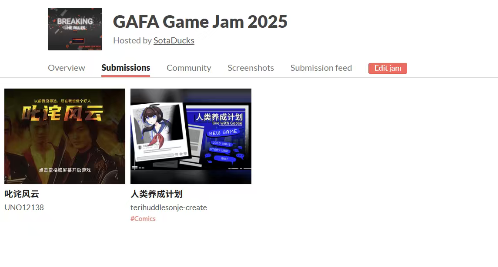
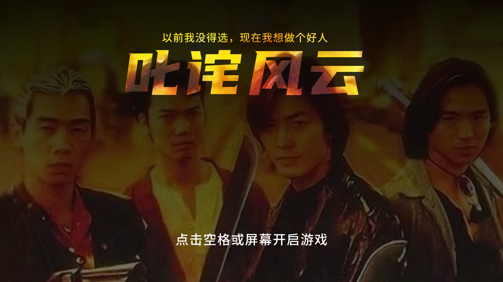
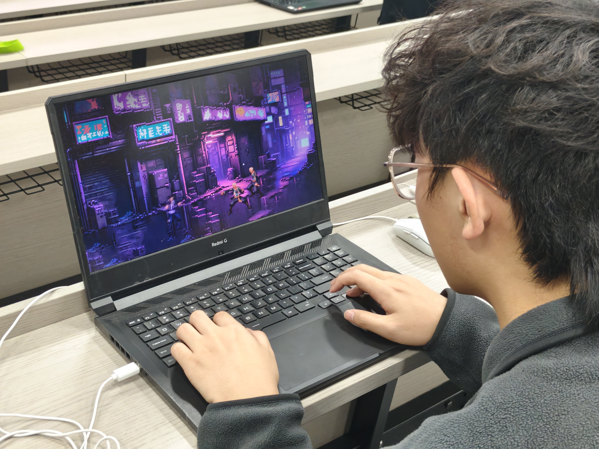
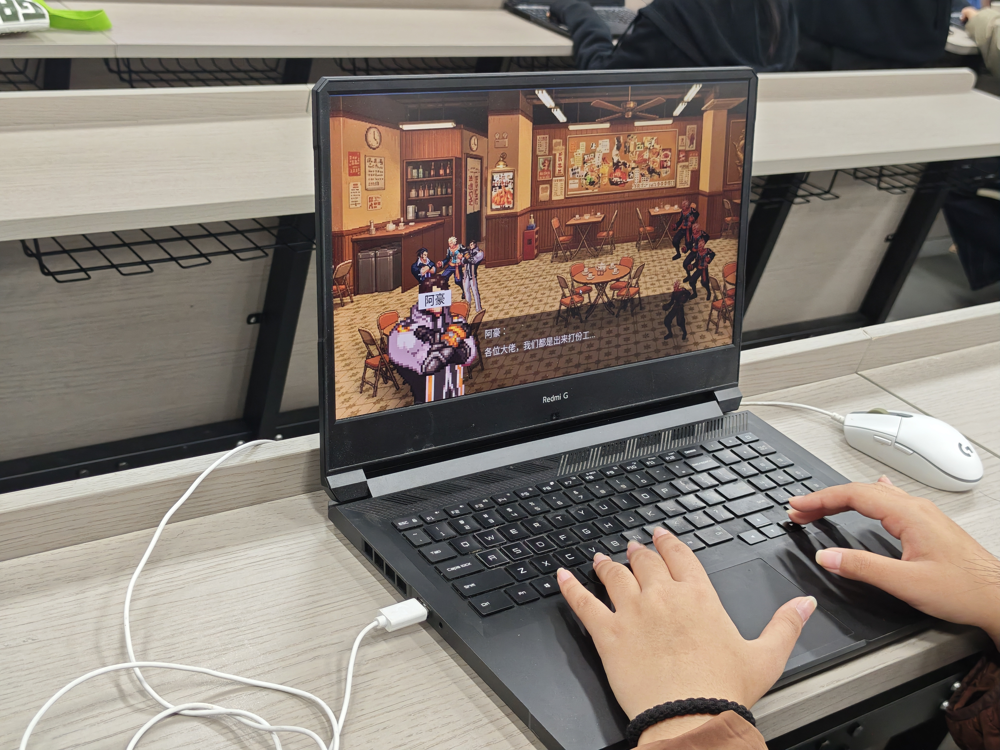

# Storm Sovereign｜Game Jam 游戏作品

> 一款以 2D 格斗为核心、融合赛博朋克与九龙城寨视觉想象的原创非商业 Game Jam 作品。

## 项目简介

《Storm Sovereign》是一款面向 Windows 的 2D 动作游戏作品。玩家将在叙事推进、NPC 交互与战斗关卡之间切换，通过移动、攻击、闪避与跳跃完成战斗，并在流程中经历对话与分支选择。

本作以横版格斗游戏紧凑、直接的战斗节奏为机制参照，尝试让高密度的城市空间、人物关系与动作对抗共同服务于一段具有港片气质的游戏叙事。

## 创作缘起

童年时期，我非常喜欢 2D 格斗游戏所带来的战斗节奏与操作反馈。进入大学后，我开始接触赛博朋克与九龙城寨的视觉风格，也被早期香港电影中鲜明的人物关系、空间调度和戏剧张力所吸引。

因此，我想以 2D 格斗游戏作为机制载体，借鉴经典港片的叙事氛围，将早期香港建筑的层叠、逼仄与烟火气融入游戏场景，让城市空间不只是背景，也成为战斗与剧情体验的一部分。

## 作品特点

- **2D 动作战斗**：包含移动、攻击、受击、生命值、闪避与跳跃等核心交互。
- **剧情与战斗结合**：以 NPC 对话、关卡事件和多段战斗流程推动体验。
- **对话分支**：在叙事流程中提供选项与分支内容，增强参与感。
- **视觉探索**：以赛博朋克的霓虹感与九龙城寨式高密度建筑意象，构建具有港片气质的场景氛围。

## 课程 Game Jam 记录

本作品完成于课程 Game Jam 活动，并以可运行版本提交。

  

## 游戏氛围与试玩记录

开场以群像构图建立港片叙事氛围；后续通过赛博街景战斗和室内 NPC 对话，将视觉探索落实到实际可玩流程中。

  

| 赛博街景战斗试玩 | NPC 对话场景试玩 |
| --- | --- |
|  |  |

## 技术信息

- **引擎**：Unity
- **平台**：Windows
- **类型**：2D 动作 / 格斗 / 叙事体验
- **项目性质**：非商业 Game Jam 作品

## 运行方式

1. 在本仓库的 [Releases](../../releases) 页面下载最新 Windows 游戏包。
2. 解压下载文件，保持文件夹结构完整。
3. 运行 `Storm Sovereign.exe` 开始游戏。

> 当前仓库用于展示作品信息与发布可运行版本，不包含 Unity 项目源码。

## 说明

本作品为个人创作与学习用途，受 2D 格斗游戏、赛博朋克视觉文化及香港电影氛围启发；不代表或关联任何既有游戏 IP。
